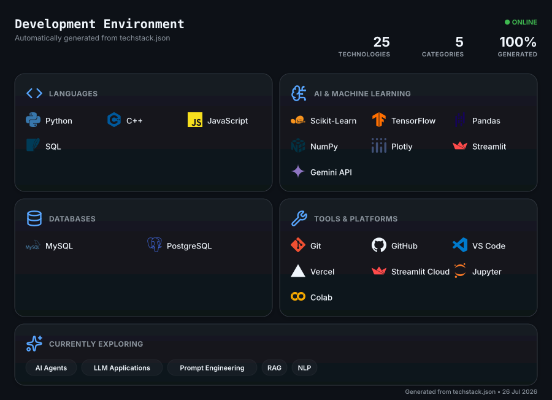

```txt
              .....,.. .,,....
          . .  . .......,*,..   ..
            .  ....   .,. ..,,**. . .,                         shubham@home
                        . ...,,.    . .                        ------------------------------------------
                    .......   .,*,,.   ..
 /            .......,,***///,  .       . .                    OS: ........... Linux
            ..*//(((((((##%%###((,..                           Uptime: ....... 17 years
          .,.*//(/((###/.,.,.,,*/((@@(    ..                   Host: ......... IIT Madras
         .. .....,.,*//,,...,,*//((((((, ...                   Kernel: ....... BS in Data Science and Application
                    ,(#//,        ,*////. ..                   Languages: .... Python, SQL
     ,      .,.    ,,*##%*//*,,,****/(*(/. ,                   Hobbies: ...... Music, Sport
            .,*,.   */#%%##*/#####//%%#(//((,                  Location: ..... Lucknow, Uttar Pradesh, India
      *   .,.**,.    ,/////(#%%##((#%##((/*#(,)
        .,,,,*,*.       */ ./###%#####(((/*(#())               ------------------------------------------
           .,,*.     .,/*((#######((((((//,(()))
             '.   .. ./((***((/***(((////*,#(#)                Focus: ........ Machine Learning & AI
                         *(##(/***/((/////,.,                  Approach: ..... Build → Deploy → Improve
   ,                .,,,,,.***/(((//////**.                    Goal: ......... ML Engineering
                 ..     . .*//((//////***,
         ,         ..,***/((##((///**,,,.*                     ------------------------------------------
                       ..,,..,,,..     .*/
                                     .**/*..                   Email: ........ shubhamkumar070605@gmail.com
                                  .,**//* .                 
                               .,**, ...   ...,                
      ,... ...                           ... ...
   .......   ....                    ....    .......
   ..........                 .. . .         ..........

shubham@home:~$ █
```
<div align="center">

[](https://git.io/typing-svg)

</div>

---


### 👋 Hey, I'm Shubham

I like building things and figuring out how they work.

Most of my projects start with a simple question: **"Can I build this?"** From there, I enjoy learning new concepts, solving problems, and turning ideas into something useful. I enjoy building complete applications where machine learning, AI, data, and software come together.

Every project teaches me something new, and that's what keeps me building. Outside of coding, you'll usually find me playing badminton, watching movies, or exploring a new tool just because it looked interesting.

<br clear="right"/>

---

<p align="center">
  
</p>

<!-- =========================================================== -->
<!--                    ENGINEERING LOG                          -->
<!-- =========================================================== -->

<h1 align="center">
  <br>
  Engineering Log
</h1>

<p align="center">

</p>

<p align="center">
<i>A curated collection of projects, architecture decisions and engineering notes.</i>
</p>

<p align="center">
━━━━━━━━━━━━━━━━━━━━━━━━━━━━━━━━━━━━━━━━━━━━━━━
</p>

---

# InternHunt

<p>
  
  
  
  
</p>

> **AI Career Platform**

```text
STATUS      ● LIVE
DOMAIN      Artificial Intelligence
BUILT ON    Python • Streamlit • Gemini API • PostgreSQL • spaCy • scikit-learn
DEPLOYED    Streamlit Cloud • Vercel
```

An AI-powered career platform that helps students analyse resumes, evaluate ATS compatibility, discover internships and receive conversational career guidance through a unified workflow.

**Core Features**

`Resume Intelligence` • `ATS Compatibility Engine` • `Career Prediction` • `Gemini AI Assistant` • `Internship Discovery` • `Analytics Dashboard`

> **Takeaway**
>
> Building accurate AI was only half the challenge. Designing an intuitive workflow that students would actually use had a much bigger impact on the final product.

[Website](https://internhuntt.vercel.app) · [Live Demo](https://internhunt.streamlit.app) · [GitHub](https://github.com/ShubhamSnSharma/InternHunt)

---

# Delhi Air Quality Forecasting

<p>
  
  
  
</p>

> **Time-Series Forecasting**

```text
STATUS      ● COMPLETE
DOMAIN      Machine Learning
BUILT ON    Python • TensorFlow • statsmodels • Pandas • scikit-learn
```

Compared classical statistical forecasting techniques with deep learning models to analyse long-term PM2.5 prediction performance and evaluate where increased model complexity provides meaningful improvements.

**Core Features**

`LSTM Forecasting` • `SARIMA` • `Holt-Winters` • `Model Benchmarking` • `Performance Evaluation`

> **Takeaway**
>
> Better forecasts came from understanding the data rather than simply choosing a more complex model.

[GitHub](https://github.com/ShubhamSnSharma/Delhi-Air-Quality-Forecasting)

---

# Interactive Portfolio

<p>
  
  
  
</p>

> **Personal Web Experience**

```text
STATUS      ● LIVE
DOMAIN      Frontend Engineering
BUILT ON    HTML5 • CSS3 • JavaScript • Canvas API • Lenis
DEPLOYED    Vercel
```

A handcrafted portfolio focused on smooth interactions, custom animations and modern browser APIs to create an immersive browsing experience without relying on heavyweight frontend frameworks.

**Core Features**

`Glassmorphism UI` • `Canvas Animations` • `Interactive Background` • `Lenis Smooth Scrolling` • `Responsive Design`

> **Takeaway**
>
> Great portfolios aren't remembered for the frameworks they use—they're remembered for the experience they create.

[Website](https://shubhamsn.vercel.app) · [GitHub](https://github.com/ShubhamSnSharma/portfolio)

------

## Development Dashboard

<p align="center">


</p>

<p align="center">

</p>

<p align="center">

</p>

-----

## Let's Connect

<div align="center">

<table>
<tr>


<td width="55"></td>

<td align="center">
<a href="https://www.linkedin.com/in/shubham-kumar070605/" target="_blank">
<br>
<b>LinkedIn</b>
</a>
</td>

<td width="55"></td>

<td align="center">
<a href="mailto:shubhamkumar070605@gmail.com">
<br>
<b>Email</b>
</a>
</td>

<td width="55"></td>


</tr>
</table>

</div>

---

<div align="center">

```python
while True:
    learn()
    build()
    improve()
```

<sub><b>Thanks for visiting.</b> See you in the next commit. </sub>

</div>
